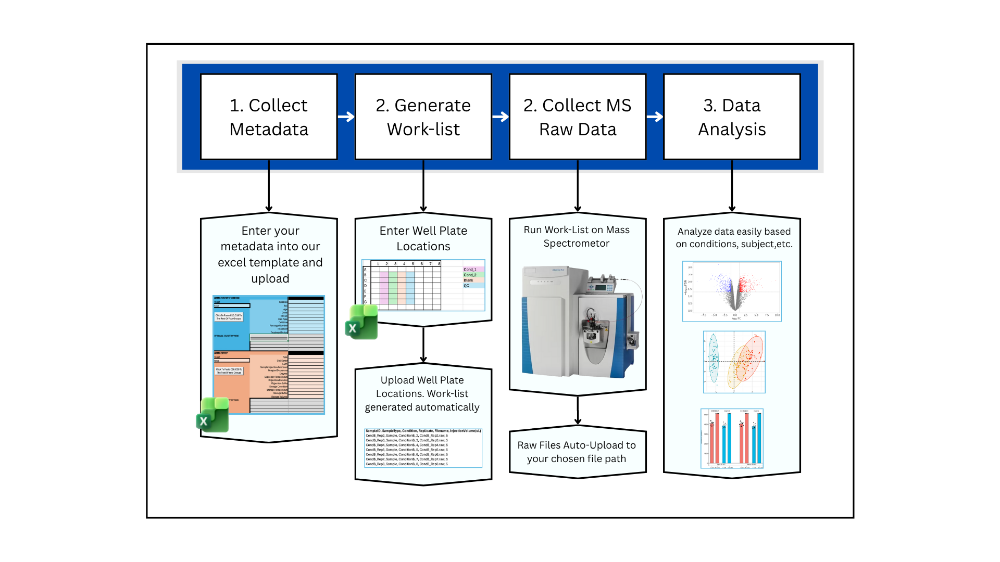

# About This Project




# Project Setup

Follow these steps to clone and run this project on macOS:

## 1. Clone the Repository

``` bash
git clone https://github.com/ctcoons/cli-metadata-generation
```

## 2. Enter the Project Directory

``` bash
cd cli-metadata-generation
```

## 3. Create and Activate the Virtual Environment

``` bash
python3 -m venv .venv
source .venv/bin/activate
```

## 4. Install Dependencies

``` bash
pip install -r requirements.txt
```

## 5. Run the Project

``` bash
python run.py
```
