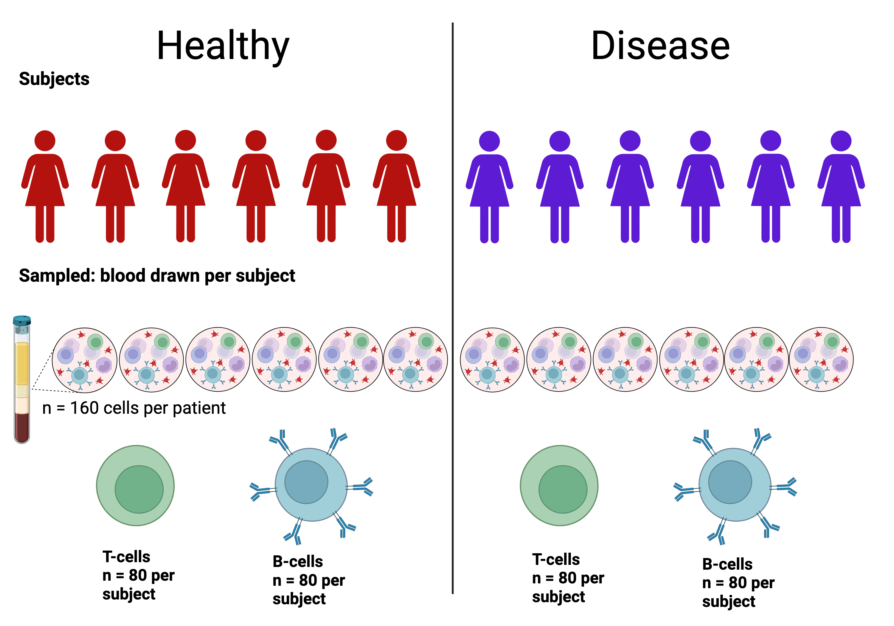

# Walkthrough: Mock Experiment B and T Cells

This walkthrough guides you through an example experiment to demonstate how to use the WorklistGenerator. The program gathers data primarily through a series of Excell template files, which the program generates and the user fills out. This walk through uses a mock experiment for single cell proteomics.

- [Project Description](#project-description)
- [Step 1: Generate metadata excel sheet](#step-1)
- [Step 2: Download excel tempate](#step-2)
- [Step 3: Geenrate worklist from completed template](#step-3)
- [Glossary](#glossary)
- [Guidance for BIG experiments](#guidance-for-big-experiments)
- [Guidance for required input](#guidance-for-required-input)
- [Guidance for non-samples like QC, Library, etc. ](#guidance-for-non-samples)

## Project Description
The mock experiment is a simple example of an A/B study design where there are two groups of human subjects (healthy and diseased). The goal of the experiment is to identify changes in B and T cells between the conditions. As can be seen in the image below, there are six subjects in each condition; all subjects are female. We assume that cells have been collected, sorted with FACS and put on 384 well-plates and now the users wants to generate a randomized run ordering. 




---

## Step 1
In this step, we will generate the metadata excell sheet by entering some basic inforamtion about the different experimental/biological conditions.

In the terminal enter:

```bash
python run.py -s 1
```

The terminal will then ask a series of questions. We have the terminal prompt below in bold, and example answers following. 
- **What is your project name:** Mock B+T Cells Exp
- **What is your project description:** The mock experiment from the paper, with parameters as outlined in the paper
- **How many conditions does your project have:** 12

After you have specified the number of condition, you will be prompted to enter a name/label for each. Below we use 'H' or 'D' to indicate healthy and diseased; a numeral represents the index of the subject with their condition group; then a 'B' or 'T' to specify the cell type.
### Conditions

1. H1B  
2. H1T  
3. D2B  
4. D2T  
5. H3B  
6. H3T  
7. D4B  
8. D4T  
9. H5B  
10. H5T  
11. D6B  
12. D6T

The metadata excel filepath will be shown in the terminal and can be found in the folder in which you downloaded the worklist generator with a path similar to this one:

```
C:\Users\<user>\OneDrive\Desktop\<folder>\.venv\worklist_git\metadata_capture\excel_utils\outputs\20260314_175710_Mock_B_T_Cells_Exp.xlsm
```

We recommend copying the text under **“Next step:”**.

---

### Fill Metadata Sheet

Remember that not all cells need to be filled out.

---

## Step 2: 

In this step we return the filled-in metadata excel file and receive a new template. This new template is where we enter the plate information.

```bash
python run.py -s 2 -m path/to/excel
```

Running this command will create the worklist template and open that file in excel for you. You can see the example template here:
[Mock Experiment](./examples/mock_b_and_t_cells_exp.xlsx)
___

### Fill User Page

The user page shows the plate layout. You will need to enter exactly where each sample is on the plate(s).

**Although conditions have already been specificed in the metadata sheet, they may be freely added of removed in the experiment excel sheet.**

For the excel sheet used in this example open:

```
\worklist_git\metadata_capture\excel_utils\outputs\20260314_175710_Mock_B_T_Cells_Exp.xlsm
```

#### Columns AD–AG

- Assign the conditions, SystemValidation, TrueBlank and Library wells a number.
- The order is not important, only that each has a unique number.

#### Column AF

- The condition names are given.
- These names will be passed into the final worklist.
- Highlighting has no effect on the program.

#### Column AG

- Notes how many samples are given per well.
- If increased, the well location is multiplied in the program and drawn multiple times.

#### Plate Setup

- When 3 plates are entered, they can all be drawn from randomly.
- Fill plates in a way convenient for pipetting.

#### Columns AI and AJ

- **Row 4:** Force even blocks
  - Each sample block contains one replicate of each sample
  - Limited by the smallest sample count
  - Still randomized from full pool

- **Row 5:** TrueBlank well location
  - Program retrieves all TrueBlank runs from this well

- **Rows 8–9:** Experiment splitting
  - Enter `All` for a single experiment
  - Or split into two ranges
  - Program randomizes separately and alternates output

- **Row 10:** Shared library
  - Enter `Yes` if both experiments use the same library
  - Improves efficiency
  - If running two experiments on the same worklist and they share the same library, the library needs to be within one of the ranges as if it were assigned to one of the experiments and not the other.

---

### Fill Manager Page

The manager page is to help you enter information relevant to file locations and other data for the LC and MS methods.

- Columns **B, C, and L** autopopulate from the user page.

#### MS and LC Inputs

- MS Data Path
- MS Method Path
- MS Method
- MS Method File Name
- LC Data Path
- LC Method Path
- LC Method
- LC Method File Name

These depend on your MS and LC machines.
The columns "MS Method" and "LC Method" are not technically required for the worklist to run but are good for record keepign.

#### Samples per well and number of samples to run

Column L lets you input the number of samples in a well. The worklist will treat the multiple samples in the well as seperate. This means the well will not be drawn from consecutively. Be aware that significant evaporation may occur in the well. 

#### QC Before / After / Between

Non condition wells are seperated into groups that run before all conditions, in blocks between the condition blocks and after the conditions. The number of wells wanted to run in each group should be entered in columns N, O, and P for before, after and between respectively.

#### Column Q Settings

- **Row 2:** Select one- or two-column system
- **Row 5:** Library placement (beginning or end)
  - Adds the library runs either before all condition runs or after all condition runs.
- **Row 8:** System validation frequency
  - Number of runs between validation runs.
  - If there are multiple different System Validation conditions added, one of each is added at a time at the frequency.
  - The program adds the QC blocks to the worklist before it adds the System Validation runs. When inputing this number account set sysval interval = QC interval + n where n is the number of runs in each qc block.
- **Row 9:** QC run frequency
  - Number of runs between QC blocks. Remember to account for system validation runs in your spacing.
- **Row 12:** LC machine type
  - Adjusts output format.

---

## Required Fields
 
The worklist template will not run unless certain fields are completed with the correct type of input. Before moving on to Step 3, double check the following fields on the worklist excel file.
 
### User Sheet
 
| Field | Requirement |
|---|---|
| A6, A24, A42, A60 | Mandatory. Must be one of `R`, `G`, `B`, or `Y`. |
| AE | Mandatory. Must be selected from the provided drop-down options. |
| AF | Mandatory. Must be alphanumeric. |
| AJ8 | Mandatory. Must be either `All` or a range of positive integers (e.g. `1-5`). |
 
### Manager Sheet
 
| Field | Requirement |
|---|---|
| Columns B–G | Mandatory for every row. |
| Columns H-K | Optional. Defaults to match input from columns D-G if left blank. |
| S2 | Optional. Defaults to `1 column` if left blank. |
| S8 | Optional. Defaults to `10` if left blank. |
 
If any mandatory field is missing or improperly formatted, the program will be unable to generate the LC and MS worklists in Step 3.
 
---

## Step 3:

In this step we return the filled-in worklist excel file and receive our newly generated LC and MS worklist files.

```bash
python run.py -s 3 -w path/to/excel -o output_directory/
```

These files may be give directly to the MS controller (e.g. Xcalibur for Thermo instrumentation).
___
### Clean Up

Always double check the worklist that the program generates. If changes need to be made, the worklist can be easily changed in manually in Microsoft Excel, Google Sheets or Apple Numbers. Make sure the file type is still ".xlsx" after changes are made.

---

### Example Output

You will receive three files as output:

1. **Experiment Summary** (from metadata sheet)
2. **LC Worklist**
3. **MS Worklist**

The summary will be found in the `output` folder.

In this example the file name was: "Mock B+T Cells Exp_summary".

Both worklists will be saved to the folder specified by the user in step 3.

---

## Glossary
- **System Validation** – Wells used by the instrument manager to monitor equipment performance across experiments; scheduled at a defined frequency.
- **QC (Quality Control)** – Control units for the current experiment, run at an interval chosen by the experimentalist.
- **TrueBlank** – Completely empty wells, used to clear LC columns after Library runs.
- **WetQC** – QC wells prepared in additional liquid.
- **Library (Lib)** – Wells used to train/validate downstream analysis methods.
- **Block** – A group of experimental units arranged to increase balance and improve randomization.

